<div align="center">

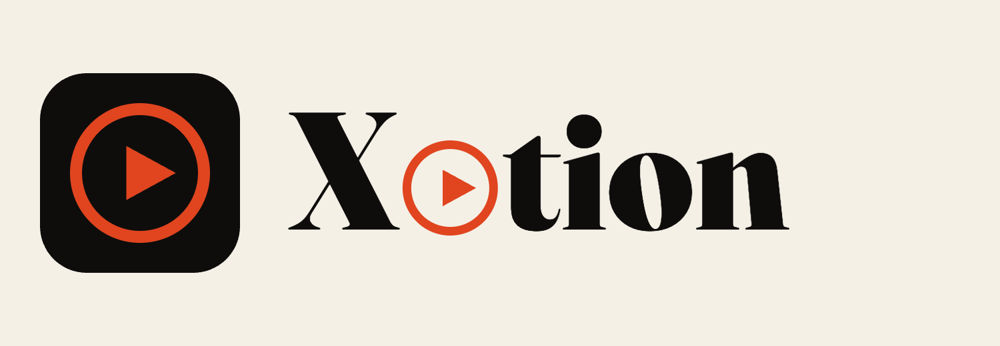

### The prompt-native video editor — **Cursor for editors.**

**You describe the edit. A team of agents produces it, checks its own work, and ships it.**
No timeline scrubbing. No keyframing. Just a prompt.

`video editing · image editing · motion graphics — offline, no per-render fees`

</div>

---

## The vision

Text-to-image and text-to-video models generate **pixels** from a prompt.
**xotion generates the *edit*** from a prompt.

Tell it *"make a 1-minute video on how AI is changing the world, female voice, with stock b-roll
and animated stats"* — or *"put these two clips side by side, mute the first, speed the second
1.6×"* — and it plans the shot list, writes the script, voices it, pulls the footage, animates the
graphics in sync with the words, mixes the audio, grades it, **verifies every frame**, and hands you
the finished file.

It's an **editing IDE**: the same way Cursor turned *describe the change → working code*, xotion
turns *describe the edit → finished video.* Effortless editing, for editors, with prompts.

> **Today** it runs as this repo inside Claude Code (clone → prompt → result).
> **The roadmap** is a standalone desktop app — the editor's IDE — driven by the same engine.

---

## Demos — made with Xotion

Real outputs, each from a one-line prompt. **Click a thumbnail to play** (opens the MP4 player on GitHub).

<table>
  <tr>
    <td align="center"><a href="https://github.com/ahkamboh/xotion-studio/blob/main/demos/xotion-iphone17.mp4"></a><br/><sub>▶ iPhone 17 Pro · 9:16 — product reveal, cosmic orange, female VO</sub></td>
    <td align="center"><a href="https://github.com/ahkamboh/xotion-studio/blob/main/demos/xotion-sticker.mp4">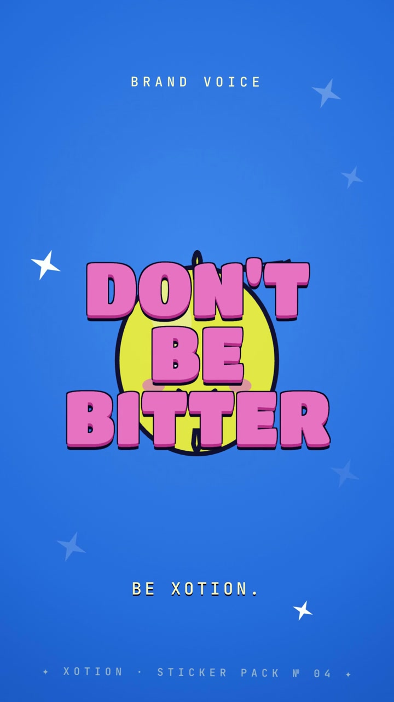</a><br/><sub>▶ Sticker Pop · 9:16 — Y2K kawaii, bubble type</sub></td>
    <td align="center"><a href="https://github.com/ahkamboh/xotion-studio/blob/main/demos/xotion-psychedelic.mp4">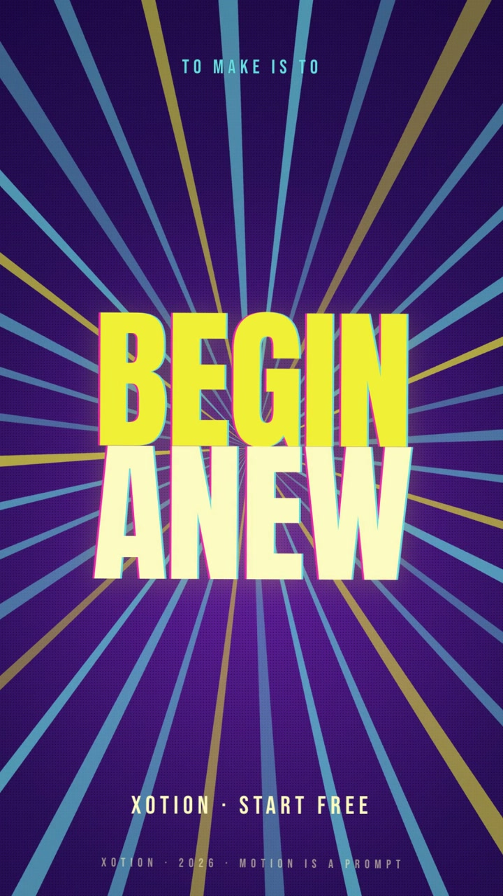</a><br/><sub>▶ Psychedelic Poster · 9:16 — halftone screen-print + sunburst rays</sub></td>
    <td align="center"><a href="https://github.com/ahkamboh/xotion-studio/blob/main/demos/xotion-bold.mp4">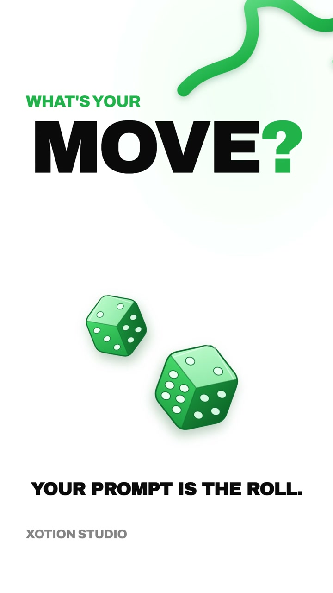</a><br/><sub>▶ Bold Dice · 9:16 — female VO + uplift bed</sub></td>
  </tr>
  <tr>
    <td align="center"><a href="https://github.com/ahkamboh/xotion-studio/blob/main/demos/xotion-dream.mp4">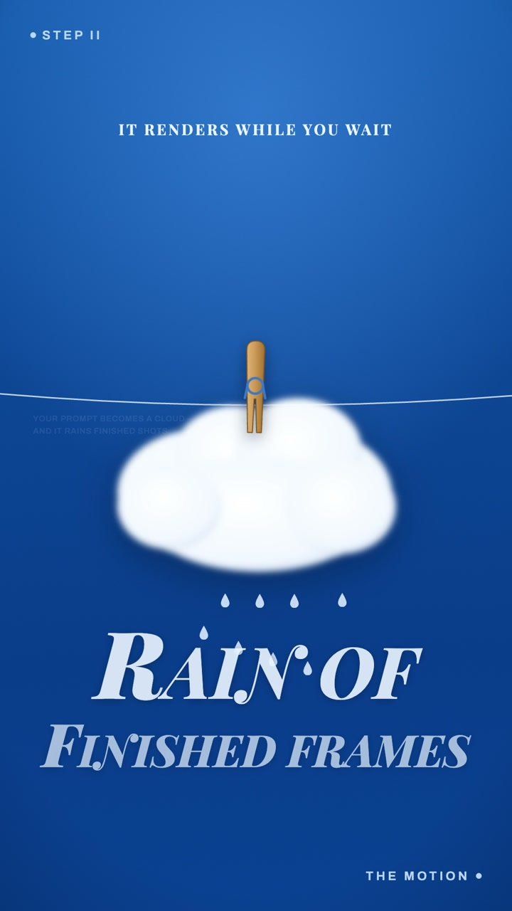</a><br/><sub>▶ Dream Poster · 9:16 — UK female VO + calm bed</sub></td>
  <tr>
    <td align="center"><a href="https://github.com/ahkamboh/xotion-studio/blob/main/demos/xotion-explainer-reel.mp4">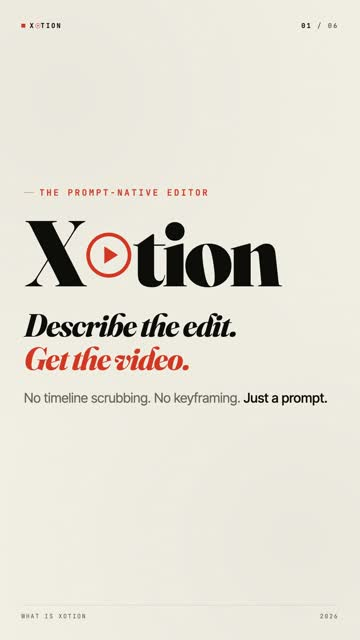</a><br/><sub>▶ Editorial explainer · 9:16</sub></td>
  <tr>
    <td align="center"><a href="https://github.com/ahkamboh/xotion-studio/blob/main/demos/xotion-riso.mp4">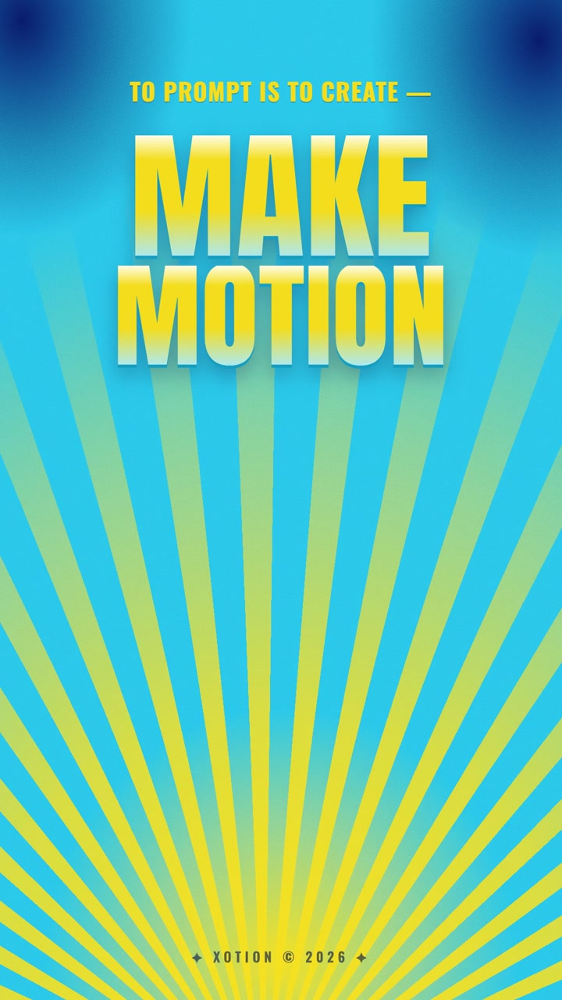</a><br/><sub>▶ Riso Print · 9:16 — male VO, no music</sub></td>
    <td align="center"><a href="https://github.com/ahkamboh/xotion-studio/blob/main/demos/xotion-neo-brutalist-reel.mp4">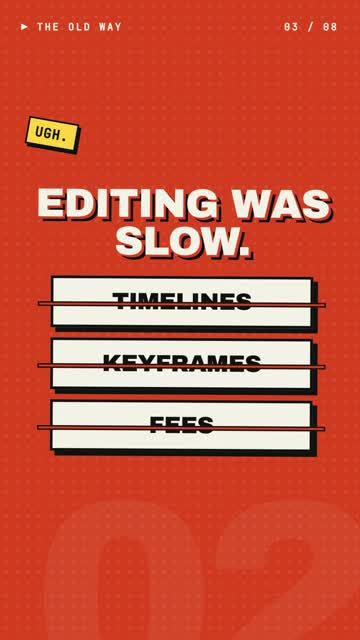</a><br/><sub>▶ Neo-Brutalist · 9:16</sub></td>
    <td align="center"><a href="https://github.com/ahkamboh/xotion-studio/blob/main/demos/xotion-neobrutalist-rendered.mp4">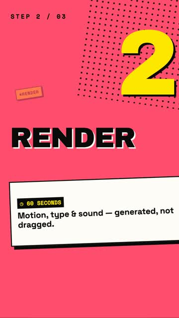</a><br/><sub>▶ Neo-Brutalist · male VO</sub></td>
    <td align="center"><a href="https://github.com/ahkamboh/xotion-studio/blob/main/demos/xotion-musk-multiplier.mp4">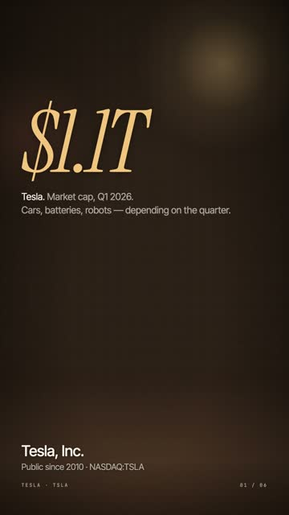</a><br/><sub>▶ Musk Multiplier · editorial</sub></td>
  </tr>
  <tr>
    <td align="center" colspan="2"><a href="https://github.com/ahkamboh/xotion-studio/blob/main/demos/xotion-explainer-16x9.mp4">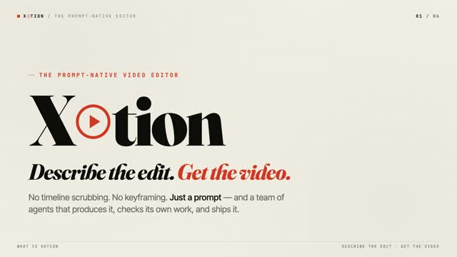</a><br/><sub>▶ Editorial explainer · 16:9 — stock b-roll + animated stats + female VO</sub></td>
    <td align="center" colspan="2"><a href="https://github.com/ahkamboh/xotion-studio/blob/main/demos/xotion-neo-brutalist-16x9.mp4">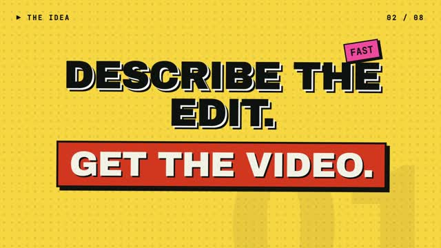</a><br/><sub>▶ Neo-Brutalist · 16:9</sub></td>
  </tr>
  <tr>
    <td align="center" colspan="4"><a href="https://github.com/ahkamboh/xotion-studio/blob/main/demos/xotion-ai-impact.mp4">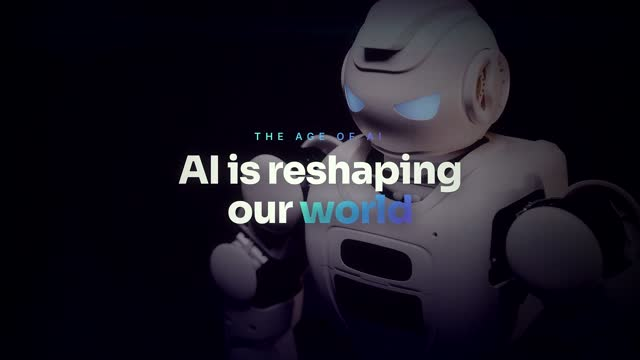</a><br/><sub>▶ AI-impact explainer · 16:9 — stock b-roll + animated stats + female VO</sub></td>
  </tr>
  <tr>
    <td align="center" colspan="4"><a href="https://github.com/ahkamboh/xotion-studio/blob/main/demos/xotion-nikhil-podcast.mp4">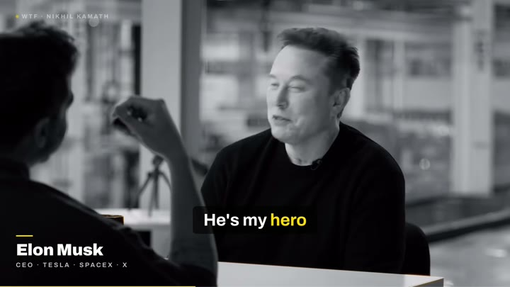</a><br/><sub>▶ Nikhil Kamath × Elon Musk · 30s podcast cut — full-screen b-roll, single-line captions, lower-third name cards, subtle punch-ins</sub></td>
  </tr>
</table>

---

## Why it doesn't make mistakes: a team of agents with QA gates

xotion isn't one model winging it. It's a **production team** — each agent owns one job with a strict
"definition of done," and **QA agents gate delivery: nothing ships until it passes.**

```
              DIRECTOR  (plans · delegates · loops until clean)
 PRE-PROD            PRODUCTION                 QA GATES (must all pass)    SHIP
 scriptwriter        sync-master                qa-audio                   delivery
 art-director   ─►   motion-builder ─► assembler ─► colorist ─►            ─► qa-correctness + qa-richness + qa-audio + license-auditor ─► ✅
 stock-scout         captioner ─► b-roll
 audio-engineer
```

If a frame is illegible, a stat is wrong, a graphic drifts off the words, or the mix clips — the QA
agent catches it and routes the fix back, re-renders, and re-checks. **The Director won't deliver
with an open failure.** Every recurring mistake is owned by one agent and killed by a gate.
→ see [`docs/agent-team.md`](docs/agent-team.md) and [`.claude/agents/`](.claude/agents).

Specialized, reusable agents already power this:
- **caption agent** — frame-accurate captions, 41 languages, 7 famous styles (Hormozi/pill/neon/TikTok…)
- **scene-sync agent** — locks every graphic to the spoken word (zero drift)
- **XChart** — tested chart library (counter/bar/donut/line) so data-graphics are always correct
- **qa-correctness / qa-richness / qa-audio / license-auditor** — four parallel ship gates: broken-output, density+motion richness, loudness/clipping, and asset licenses

---

## What you can make

| Pillar | Engine | Examples |
|---|---|---|
| **Motion graphics** | HyperFrames (HTML+GSAP→MP4) | explainers, promos, kinetic type, **animated data/charts**, lyric & caption videos, logo reveals, 3D/glass showcases |
| **Video editing** | ffmpeg | trim · speed · split-screen · concat · grade · stabilize · green-screen · transitions · reels · auto-cut · aspect convert |
| **Image editing** | ffmpeg / ImageMagick | resize · crop · compose · background removal · thumbnails · social graphics |

Plus: stock b-roll (Pexels), TTS voiceover, music beds + ducking, premium finish (bloom/grain/grade),
JS graphics overlays (particles/3D/aurora/glass), multi-language subtitles, data-driven batch video.

---

## Quick start

```bash
brew install git-lfs && git lfs install          # the Whisper model ships in-repo via LFS
git clone https://github.com/ahkamboh/xotion-studio.git
cd xotion-studio && git lfs pull
./scripts/setup.sh                               # installs the render engine (pinned), python deps, models
```

Open **Claude Code** in the folder and just say what you want:

```
make a 30s explainer on <topic>, female voice, tech style, with stock b-roll and animated stats
add Hormozi captions to @clip.mp4
put @a.mp4 and @b.mp4 side by side, 3:4, mute the first, speed the second 1.6×
```

Everything runs **offline, no API keys** — bundled Whisper model + fonts, pinned engine.

---

## ⚡ One-paste kickstart (any AI agent)

New machine, or want an AI agent to set everything up and start editing? **Copy this whole block and
paste it to Claude Code (or any coding agent) in an empty folder:**

```
You are operating the Xotion prompt-native video editor. Do this:

1. Clone and set up the repo:
   brew install git-lfs && git lfs install
   git clone https://github.com/ahkamboh/xotion-studio.git
   cd xotion-studio && git lfs pull && ./scripts/setup.sh

2. Read these IN ORDER to learn the whole system, then confirm you understand:
   - HANDOFF.md   (the full onboarding: how it works, tools, decisions, current state)
   - CLAUDE.md    (the engine brain: the Director 7-step playbook + the agent team + rules)
   - COMMANDS.md  (the ":" shorthand commands)

3. Operate as the Director: for any video job, follow CLAUDE.md's 7-step loop
   (Understand → Analyze → Decide → Plan → Confirm → Execute → Review), delegate to the
   specialist agents in .claude/agents/, and NEVER deliver until qa-correctness + qa-richness + qa-audio + license-auditor all pass.
   Use the libraries (templates/lib/richness.js + charts.js), scene-sync.py, and caption.py —
   never hand-roll charts or scene timing. Keep everything offline / no API keys.

Once set up, ask me what to make, then show me your ASSET REPORT + EDIT PLAN before editing.
```

After it confirms, just give it a file + a one-line prompt (e.g. *"make a 30s neon-caption reel from
@clip.mp4"*) and it runs the full pipeline.

---

## Prompt it — the `:` shorthand

`@file` = input · `:cmd` = action · chain them · `=value` passes options. Full list: [`COMMANDS.md`](COMMANDS.md).

```
:short @podcast.mp4                 # talking clip → captioned, finished Short
:lyric @song.mp3 :style=noir        # noir lyric video
:caption :neon :lang=ur @reel.mp4   # Urdu neon captions
:rich :aurora @plain.mp4            # graphic overlay + premium finish
:help                               # list every command
```

---

## Under the hood

```
CLAUDE.md            # the engine brain: pillars, rules, the agent-team operating model
.claude/agents/      # 13 specialist subagents (the team)
docs/agent-team.md   # the Director pipeline + QA gates
COMMANDS.md          # the : command vocabulary
scripts/             # caption · scene-sync · pixabay-* · tts · mix · enrich · overlay · qa-audio · qa-frames …
templates/           # compositions + lib/charts.js (XChart)
presets/             # 12 visual styles · motion presets · video presets
prompts/             # copy-paste job prompts
models/small.pt      # bundled Whisper model (offline captions)
assets/fonts/        # 73-family type library
projects/            # one folder per job
```

Built on **[HyperFrames](https://github.com/heygen-com/hyperframes)** (Apache-2.0, HTML→video),
**FFmpeg**, **OpenAI Whisper** (MIT), **Kokoro** TTS, **GSAP**, **Pexels** stock, and Google Fonts (OFL).
Full attribution in [THIRD_PARTY.md](THIRD_PARTY.md).

---

## Roadmap

- ✅ Prompt → finished video, offline, via Claude Code + the agent team
- ✅ Self-verifying QA gates (audio + visual) so it ships mistake-free
- ⏭ Standalone **desktop IDE** for editors (timeline-optional, prompt-first)
- ⏭ On-device model (MLX/Ollama) driving the team — fully local, private
- ⏭ More QA agents (safe-area, stock-relevance) + one-command `:make` end-to-end

---

<div align="center">

**xotion — describe the edit, get the video.**

</div>
