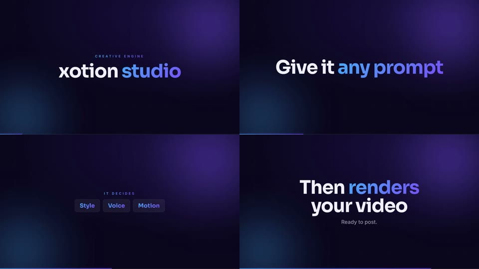

# xotion-studio

Private **creative engine** — clone on any machine, give Claude Code files + a one-line prompt,
get the result on autopilot. **Video editing · image editing · motion graphics.**

Built on [HyperFrames](https://hyperframes.heygen.com) (HTML+GSAP→MP4) for motion graphics,
**ffmpeg / ImageMagick** for video & image editing, **Whisper** for captions, **Kokoro** for TTS,
**u2net** for background removal.

## Quick start (new machine)

```bash
# git-lfs is required — the Whisper model ships in the repo (no re-download).
brew install git-lfs        # or: apt-get install git-lfs    (one time per machine)
git lfs install

git clone https://github.com/ahkamboh/xotion-studio.git
cd xotion-studio
git lfs pull                # pulls the bundled Whisper small model (~460 MB)
./scripts/setup.sh          # one-time: installs hyperframes locally (pinned, from
                            #   package-lock.json), fetches the render browser, copies
                            #   the Whisper model into cache, installs python deps
```

After `setup.sh`, **HyperFrames runs locally with no further downloads** — `npx hyperframes`
resolves to the pinned local copy (v0.6.70) instantly, offline. `node_modules/` is regenerated
per machine via `npm ci`, so it stays platform-correct (committing 400 MB of native binaries
would be Mac-arm64-locked and blow the LFS quota — the lockfile is the right way).

> The **Whisper `small` model is bundled** in `models/small.pt` via Git LFS, so transcription
> works offline immediately and never re-downloads (also avoids the model-hub SHA-corruption issue).
> `setup.sh` copies it to `~/.cache/whisper/small.pt`.

Open **Claude Code** in this folder and paste a prompt from `prompts/`. Claude reads `CLAUDE.md`
automatically and follows the full toolkit — you just provide files.

## What it can do

| Pillar | Engine | Examples |
|---|---|---|
| **Motion graphics** | HyperFrames | title cards, intros/outros, promos, explainers, kinetic type, data-viz, logo reveals, lower-thirds, lyric/caption videos, animated infographics |
| **Video editing** | ffmpeg | trim, cut, concat, speed, reverse, crop, rotate, scale, color grade, stabilize, overlay/PiP, green-screen, xfade transitions, burn subtitles, watermark, audio swap, GIF, aspect conversion |
| **Image editing** | ffmpeg / ImageMagick | resize, crop, convert, filters, text, compositing, collages, background removal, thumbnails, social graphics |

Most jobs combine pillars (e.g. grade footage + overlay an animated title).

## Prompts

| Prompt | Use |
|---|---|
| `prompts/edit-video.md` | "edit this video [trim / speed / reel / logo / grade...]" |
| `prompts/edit-image.md` | "edit/convert/compose this image" |
| `prompts/motion-graphics.md` | "make a [title / promo / explainer / data-viz / intro]" |
| `prompts/captioned-video.md` | add captions / lyrics / brand graphics to any video |
| `prompts/lyric-video.md` | image + audio → lyric video + thumbnail + reels |

## Layout

```
CLAUDE.md                 # the brain: 3 pillars, workflows, rules, house style
README.md
new-project.sh            # ./new-project.sh name [W] [H] [duration]
brand.example.json        # copy to brand.json -> auto-apply client colors/fonts/logo
templates/                # title-card, thumbnail, lyric (16:9 & 9:16), ugc-ad,
                          #   reactive-captions, lottie-overlay
scripts/                  # transcribe, amplitude, tts, remove-bg, concat, export-subs,
                          #   translate-subs, normalize-audio, grade, music-bed, find-hooks,
                          #   verify, encode-youtube, cut-reels, thumbnail, download-fonts, setup
prompts/                  # copy-paste job prompts
docs/                     # ffmpeg-recipes, caption-styles, FONTS, encoding-cheatsheet
assets/fonts/             # ~73-family design library (.ttf, local)
models/small.pt           # bundled Whisper model (Git LFS) — offline transcription
projects/                 # one folder per job (renders/work gitignored)
```

## Worked example — narrated promo (end-to-end, verified ✅)

A real run of the full chain, built entirely from the engine's own scripts. Source lives in
`projects/demo-promo/`; the render is `projects/demo-promo/renders/demo-promo.mp4`.



**Prompt:** *"Make a short narrated promo for xotion studio, female voice, tech style, 16:9."*

**What the agent did (all no-API):**
```bash
# 1. Art direction: prompt -> Tech Gradient style (blue-purple, Sora + Inter), 16:9   [presets/styles.md]
# 2. Voiceover (female)
scripts/tts.sh projects/demo-promo/work/script.txt af_nova work/vo.wav        # docs/voices.md
# 3. Scene timing from the voice
python3 scripts/transcribe.py work/vo.wav --model small --lang en --out work/vo-transcript.json
# 4. Background music + duck it under the voice, master to -14 LUFS
scripts/music-bed.sh work/bed.wav 8 uplift
scripts/mix-audio.sh work/vo.wav work/bed.wav assets/master.wav 0.30
# 5. Build from templates/narrated-motion.html, scenes timed to the VO words
npx hyperframes lint            # 0 errors
npx hyperframes render --output renders/demo-promo.mp4
# 6. Acceptance loop — mechanical gate + read every frame
scripts/qa.sh renders/demo-promo.mp4 --w 1920 --h 1080 --fps 30 --dur 7.5
```

**Result:** 1920×1080 · 30fps · 7.5s · voice over ducked music (−15.5 dB) · 4 scenes
(`xotion studio` → `Give it any prompt` → glass `Style / Voice / Motion` chips → `Then renders
your video`). QA mechanical gate **PASS**; all four scenes visually verified.

This confirms the pipeline works: art-direction style → TTS → transcription → music bed →
auto-ducked mix → motion-graphics render → QA. Reproduce or restyle by changing the prompt.

## Capabilities at a glance

- **Transcribe** (offline, bundled model) · **TTS voiceover** · **subtitles** (.srt/.vtt) ·
  **offline translation** to any language
- **Caption styles**: 6 looks (house, karaoke, bold punch-in, typewriter, slide-up, word-pop)
- **Color grades**: teal-orange, warm, moody, vintage, clean, vibrant, b&w, cine
- **Audio**: loudness normalize (−14 LUFS), generate ambient music beds, mix/duck
- **Auto reels**: hook detection scores the best segments for Shorts
- **Brand kits**: `brand.json` auto-applies colors/fonts/logo
- **QA**: `verify.sh` frame-extraction + HyperFrames visual inspect
- **Thumbnails** & **Lottie** icon animations · **SFX pack** (whoosh/riser/impact/…)

## Requirements

Node.js ≥ 22, ffmpeg, Python 3.9+ (whisper installs via setup). ImageMagick optional for some
image ops (`brew install imagemagick`). macOS / Linux (Windows: WSL).

See `CLAUDE.md` for the non-negotiable engineering rules and house style.
